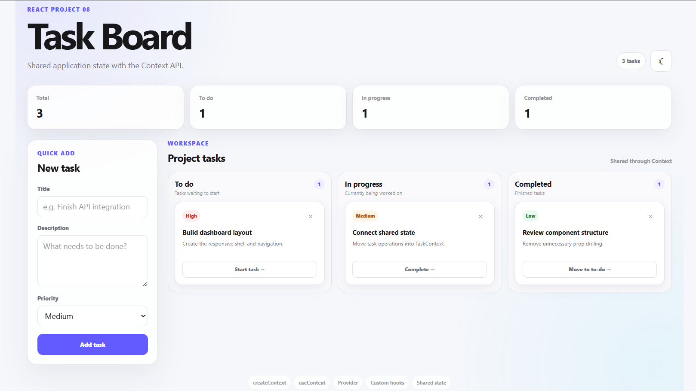
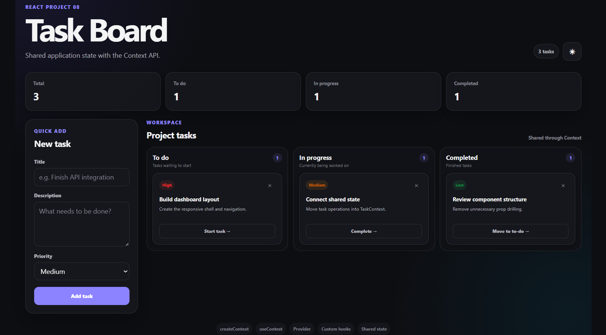

===============================================================================================================================


# React Project 08 — Context API Task Board

This project is focused on **React Context** and solving prop drilling.

We are building a task board where multiple components need access to the same task state and operations.

## Run

```bash
npm install
npm run dev
```

## Main concepts

- `createContext`
- `useContext`
- Context Provider
- Custom hooks around Context
- Shared application state
- Avoiding prop drilling
- `useMemo`
- Derived state
- Controlled forms
- Immutable array updates
- Theme context
- `localStorage`

## Why Context?

Imagine this architecture:

```text
App
 ↓
Board
 ↓
Column
 ↓
TaskCard
```

If `TaskCard` needs a function owned by `App`, we could pass it through every level:

```text
App
 ↓ props
Board
 ↓ props
Column
 ↓ props
TaskCard
```

That becomes prop drilling.

With Context:

```text
        TaskProvider
       /     |      \
    Board Column  TaskCard
       \     |      /
          useTasks()
```

Any descendant can consume the shared value.

## The core pattern

Create a context:

```jsx
const TaskContext = createContext(null);
```

Provide a value:

```jsx
<TaskContext.Provider value={value}>
  {children}
</TaskContext.Provider>
```

Consume it:

```jsx
const { tasks, addTask } = useTasks();
```

## Why create a custom hook?

Instead of repeating:

```jsx
useContext(TaskContext);
```

throughout the app, the project uses:

```jsx
useTasks();
```

The hook also protects against using the context outside its provider.

## Important distinction

Context is **not automatically state management**.

Context provides a way to distribute a value.

The value can contain:

- state
- functions
- constants
- derived values
- anything your application needs

Here, `useState` owns the task state and Context distributes it.

## Challenges

### Challenge 1 — Persist tasks

Persist tasks to `localStorage`.

Use `useEffect` and initialize state from saved data.

### Challenge 2 — Task editing

Add an Edit button.

Open the existing task in the form and update it instead of creating a duplicate.

### Challenge 3 — Search

Add a global search input.

The search component should consume the task Context directly instead of receiving tasks through props.

### Challenge 4 — Task filters

Add:

```text
All
High
Medium
Low
```

Again, derive the filtered list rather than storing it as separate state.

### Challenge 5 — Separate contexts

Split the application into:

```text
TaskContext
ThemeContext
```

The starter already demonstrates this pattern.

Think about why unrelated state should not necessarily share one giant context.

### Challenge 6 — Context performance

Study what happens when the provider's `value` object is recreated on every render.

Experiment by removing `useMemo` around the provider value.

Then add it back and understand what changed.

### Challenge 7 — Context + reducer

Refactor TaskContext so task state uses `useReducer` instead of `useState`.

Create actions:

```text
ADD_TASK
MOVE_TASK
DELETE_TASK
UPDATE_TASK
CLEAR_TASKS
```